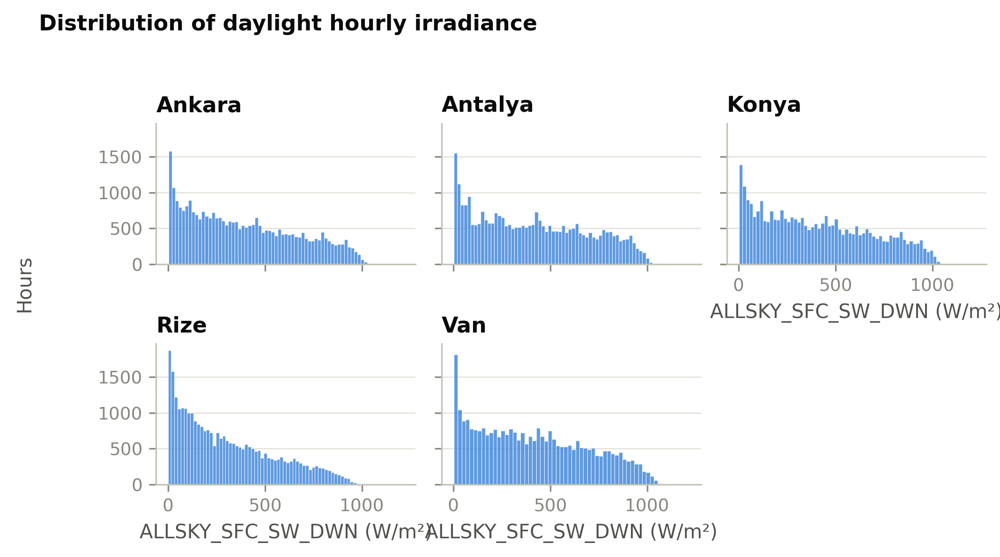
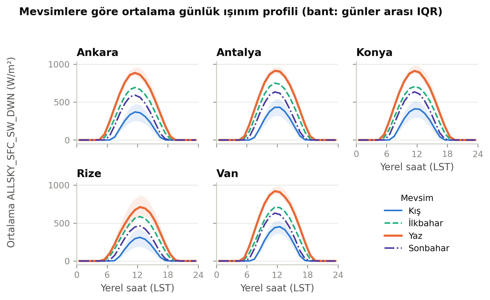
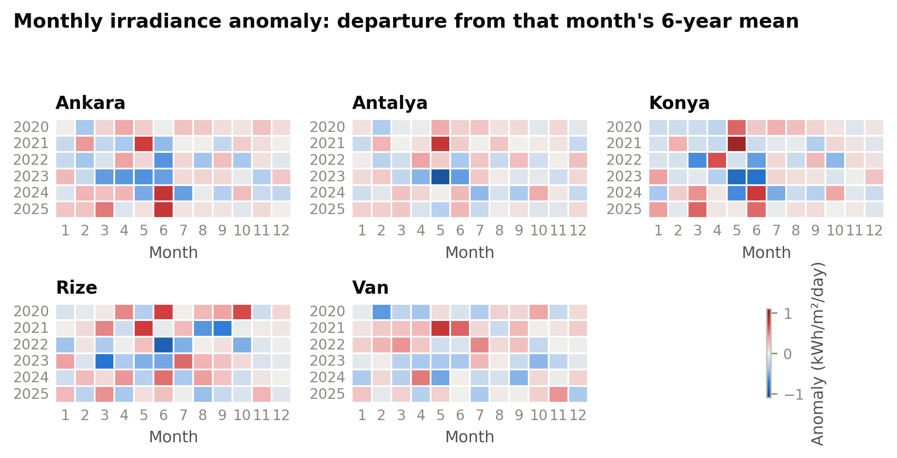
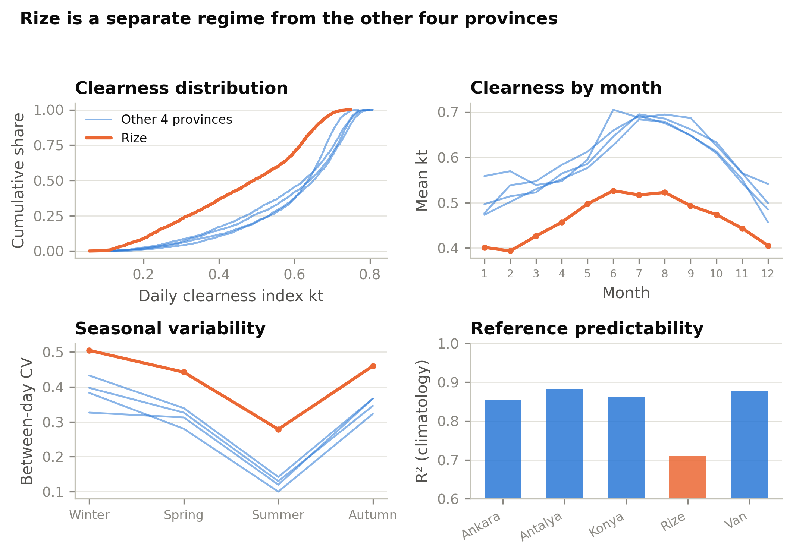
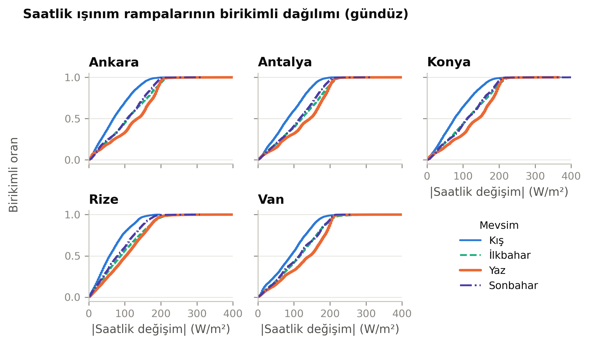
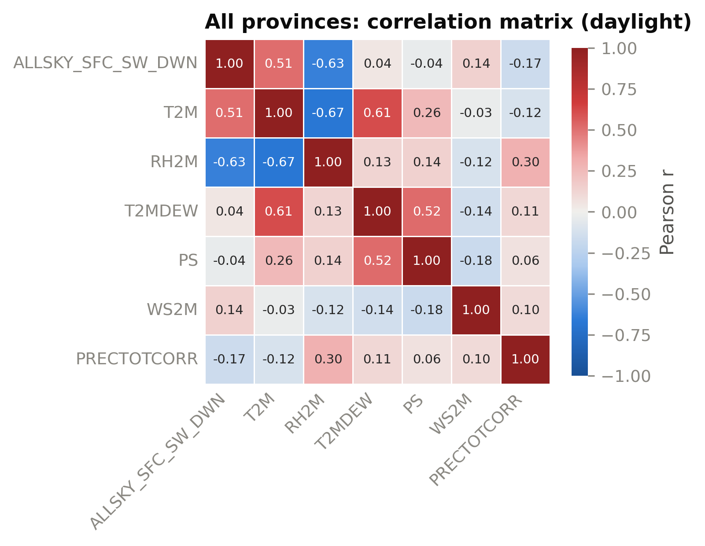
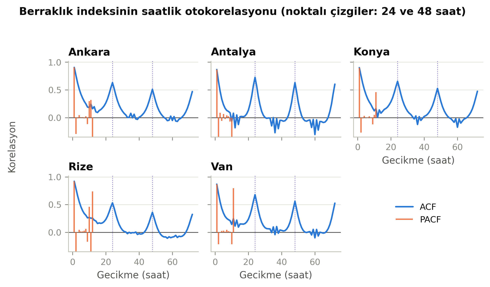
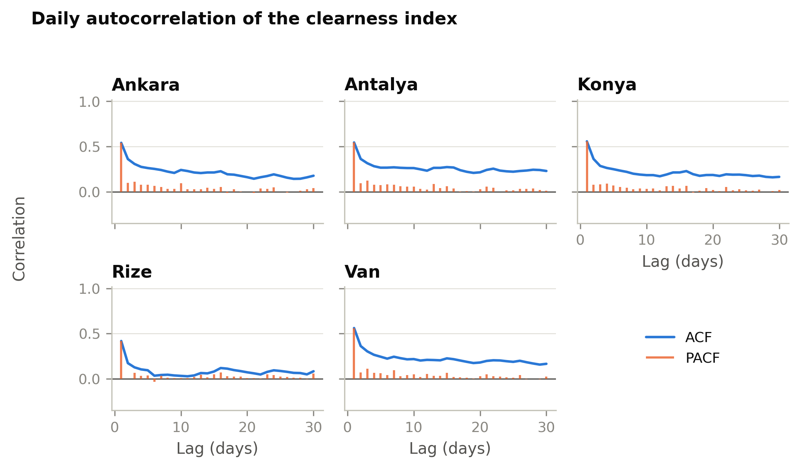
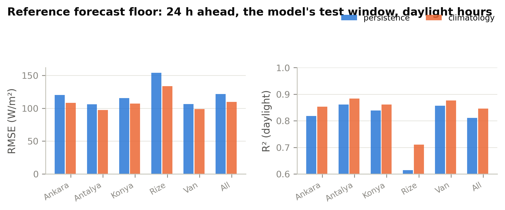

# Dataset Description

## 1. Source and study sites

The data used in this study are hourly meteorological and solar-radiation records obtained from
the NASA Prediction Of Worldwide Energy Resources (POWER) project, which derives surface
solar-radiation fields from satellite observations and assimilated meteorological reanalysis.
Records were retrieved for five provinces of Türkiye — Ankara, Antalya, Konya, Rize and Van —
selected to span distinct climatic and topographic settings rather than to represent a single
region. Their coordinates and elevations are given in Table 1.

**Table 1.** Study sites.

| Province | Latitude (°N) | Longitude (°E) | Elevation (m) | Setting |
|---|---|---|---|---|
| Ankara | 39.93 | 32.86 | 890 | Central Anatolian plateau, semi-arid |
| Antalya | 36.90 | 30.69 | 30 | Mediterranean coast |
| Konya | 37.87 | 32.48 | 1020 | Central Anatolian steppe, continental semi-arid |
| Rize | 41.02 | 40.52 | 5 | Eastern Black Sea coast, humid subtropical |
| Van | 38.49 | 43.38 | 1725 | Eastern Anatolian highland, continental |

The site selection is deliberately asymmetric, and the analysis below shows that the asymmetry is
larger than the geographic spread suggests: four of the five sites form a single radiative
regime, while Rize constitutes a second one. This is treated as a property of the dataset rather
than as a limitation, because it is precisely the configuration under which a model's ability to
transfer across climates can be tested.

## 2. Temporal coverage and sampling

Each site is represented by an uninterrupted hourly series spanning 30 June 2019 00:00 to
30 May 2026 23:00, comprising 60,648 hourly observations per site — 2,527 days, or approximately
6.92 years — and 303,240 observations in total. Coverage is identical across sites: the five
series share the same timestamps, with no gaps, no duplicate timestamps and no missing values
after the preprocessing described in Section 4.

The record terminates on 30 May 2026 because the provider's near-real-time processing latency
leaves the final 744 hours of the retrieved file without validated irradiance values. Those hours
were removed; the meteorological variables are complete to the end of the retrieved file, so the
truncation is governed by the target variable alone.

### 2.1 Time convention

An aspect of the data that materially affects any diurnal analysis is that the hourly timestamps
are **not expressed in a single time zone**. Each site is recorded in its own whole-hour local
solar time, corresponding to UTC offset by the nearest hour to its longitude.

This was verified from the data itself. Taking the irradiance-weighted centre of mass of the mean
diurnal profile as an empirical solar-noon estimate yields

> Konya 11.24 ≈ Ankara 11.24 < Antalya 11.41 < Van 11.58 < Rize 11.91

which is the **reverse** of the ordering that a shared national clock would produce — under a
common clock the easternmost sites would peak earliest — and reproduces the longitude-derived
expectation to within 0.11 h at every site.

Two consequences follow and are observed throughout the analysis. First, a given hour index does
not denote the same physical instant at different sites, so hourly quantities are never pooled or
compared across sites; each site is presented in its own panel. Second, the cyclical encoding of
the hour of day used as a model input is more informative under this convention than it would be
under a shared clock, because each site is implicitly encoded in its own solar time. Hour labels
denote the start of the interval they cover; all diurnal figures are plotted at interval centres
and axes are labelled in local solar time.

## 3. Variables

The retrieved dataset provides one radiation variable, which is used as the forecast target, and
six meteorological variables used as predictors, together with the calendar fields required to
construct the timestamp. Table 2 reports pooled descriptive statistics over the complete record.

**Table 2.** Descriptive statistics of the retrieved variables, pooled over all five sites and
all 303,240 hourly observations.

| Variable | Description | Unit | Mean | SD | Min | Max | Skewness |
|---|---|---|---|---|---|---|---|
| ALLSKY_SFC_SW_DWN | All-sky downward shortwave irradiance at the surface (target) | W/m² | 193.75 | 275.23 | 0.00 | 1216.67 | 1.28 |
| T2M | Air temperature at 2 m | °C | 11.96 | 10.38 | −24.33 | 42.30 | 0.06 |
| RH2M | Relative humidity at 2 m | % | 64.84 | 24.45 | 3.36 | 100.00 | −0.37 |
| T2MDEW | Dew-point temperature at 2 m | °C | 3.93 | 7.37 | −30.33 | 23.81 | −0.19 |
| PS | Surface pressure | kPa | 88.32 | 6.04 | 75.74 | 97.73 | −0.65 |
| WS2M | Wind speed at 2 m | m/s | 2.15 | 1.42 | 0.00 | 13.65 | 1.39 |
| WD2M | Wind direction at 2 m | ° | — (circular; see Section 8.2) | | | | |
| PRECTOTCORR | Bias-corrected total precipitation | mm/hour | 0.073 | 0.282 | 0.00 | 14.49 | 9.45 |

Two variables require comment before any statistic drawn from them is interpreted.

**Surface pressure does not behave as a meteorological variable in a pooled setting.** Its pooled
standard deviation is 6.04 kPa while its between-site standard deviation is 6.72 kPa: essentially
all of its variance lies between sites rather than within them (site means range from 77.7 kPa at
Van to 96.0 kPa at Antalya), reflecting elevation rather than weather. Its within-site variation,
with a standard deviation of roughly 0.4–0.5 kPa, is the genuine synoptic signal. In a pooled
model, surface pressure therefore functions largely as an elevation indicator, and this is the
reason its apparent relationship with irradiance reverses once site and season are held fixed
(Section 9).

**Precipitation is effectively a binary variable at hourly resolution.** Exactly 66.7% of daylight
hours record zero precipitation, and the non-zero tail is strongly right-skewed (skewness +9.4
over all hours). A binary wet/dry indicator is more strongly associated with irradiance than the
recorded amount at three of the five sites, while at Rize a logarithmic transform of the amount is
the stronger of the two (Table 6).

**Dew-point temperature is not an independent measurement.** It can be reconstructed from air
temperature and relative humidity through the Magnus relation with a Pearson correlation of
0.99919 and a root-mean-square deviation of 0.30 °C over all hours (0.99957 and 0.23 °C over
daylight hours) — that is, at the level of the data's own rounding. It is retained for
completeness but carries no information beyond the two variables from which it is derived. This
redundancy is invisible to pairwise correlation analysis, because it is a two-variable
relationship: the pairwise correlation between air temperature and dew point is only 0.61
(Section 9.2).

## 4. Data quality and preprocessing

**Missing values.** The provider encodes missing observations with a sentinel value. After
removal of the 744-hour near-real-time tail described in Section 2, no sentinel value and no
missing entry remains in any variable at any site. No imputation was performed, and no
observation was interpolated.

**Units.** The retrieved irradiance is expressed in MJ/m² per hour and was converted to W/m² for
consistency with the solar-forecasting literature; the conversion is exact and linear.
Precipitation is retained in mm/hour, the natural unit for an hourly record. Summing the
precipitation column over complete calendar years yields site totals of 340 mm (Ankara), 326 mm
(Konya), 343 mm (Van), 664 mm (Antalya) and 1399 mm (Rize) per year, which reproduce the correct
ordering and order of magnitude of Turkish climate normals and confirm the unit interpretation.
Consistent with the known behaviour of satellite-derived precipitation products, the values
under-estimate observed normals at the two wettest sites.

**Numerical resolution.** The retrieved irradiance is stored to two decimal places in its source
unit, which after conversion places the target on a discrete grid with a step of 2.78 W/m²; the
entire record contains 387 distinct target values. The resulting quantisation noise has a standard
deviation of 0.80 W/m², below 1% of the error of the weakest reference forecast considered here,
and is therefore immaterial to the reported accuracy metrics. It is stated because it sets a floor
on the resolution at which any irradiance difference in this dataset can be interpreted, and
because it affects how daylight is best identified (Section 5).

**Physically inadmissible values.** One observation in the record (Van, 17 February 2020, 15:00
local solar time) reports 1216.67 W/m², which exceeds the extraterrestrial irradiance incident on
a horizontal surface at that site and hour (544 W/m²) by more than a factor of two. It is
physically impossible and is treated as a retrieval or back-fill artefact. It was neither removed
nor modified, since a single observation in 303,240 cannot affect any aggregate reported here, but
it must not be used to support any claim about the radiative extremes of the site.

## 5. Definition of daylight hours

Roughly half of all hourly observations are night hours in which the target is exactly zero. These
observations are trivially predictable and, if included, dominate aggregate error statistics
(Section 12). Separating them therefore requires an unambiguous criterion, and the criterion used
here is **geometric**: an hour is classified as daylight if the apparent elevation of the Sun at
the midpoint of that hour, computed from the site coordinates and the timestamp using a standard
solar-position algorithm, is positive. Under this definition 152,893 of 303,240 observations
(50.42%) are daylight, with a mean daylight duration of 12.07–12.14 h per day across sites.

Two alternative criteria were examined and rejected.

The first is a threshold on the observed irradiance itself. On this dataset it agrees with the
geometric criterion on 303,204 of 303,240 observations, yet it is inadmissible on two grounds.
It defines the evaluation subset using the quantity being predicted, so that a heavily overcast
twilight hour recording zero is silently excluded — that is, observations are removed
preferentially from the conditions under which a forecast is hardest. More decisively, it cannot
be evaluated prospectively: a day-ahead forecast must determine whether the Sun will be above the
horizon at a future hour without access to the observation at that hour, so a criterion based on
the observation cannot be applied operationally. A geometric criterion is therefore required in
any case, and adopting a different one for evaluation would be internally inconsistent.

The second is a climatological criterion based on the mean irradiance of a (site, month, hour)
cell. This is too coarse: sunrise and sunset shift by 30–60 minutes within a calendar month, so
the boundary hour of a cell is illuminated for part of the month and dark for the remainder, and a
cell mean classifies the entire hour as daylight. Applied to this dataset it admitted 5,266
observations occurring when the Sun was below the horizon.

The geometric threshold was not calibrated against the observations. Sweeping it produces a value
that agrees more closely with the recorded irradiance, but adjusting a geometric criterion to fit
the observed target reintroduces exactly the dependence the criterion is intended to avoid. The
cost of leaving it uncalibrated was quantified and is small: the error of the strongest reference
forecast changes by approximately 1%.

The residual disagreement between the geometric criterion and the recorded values is small and
falls in the conservative direction. One daylight-classified observation records exactly zero.
Conversely, 2,968 observations classified as night carry non-zero irradiance; these are twilight
hours in which sunrise occurs part-way through the interval, and together they account for 0.024%
of total daylight energy. Excluding them makes the daylight subset marginally harder to predict,
not easier.

## 6. Statistical characterisation of the target

### 6.1 Distribution

Over daylight hours and pooled across sites, irradiance has a mean of 384.2 W/m², a median of
341.7 W/m² and a standard deviation of 277.7 W/m², with skewness +0.42 and excess kurtosis −0.94.
Over all 24 hours the mean falls to 193.7 W/m² and the median to 8.3 W/m², with skewness +1.28.

The contrast between these two summaries reflects the mixture structure of the unconditional
distribution: a point mass of exact zeros at night superimposed on the daylight distribution. The
daylight distribution itself is **platykurtic** — broad and flat rather than peaked — which is the
direct consequence of solar geometry sweeping irradiance from zero to approximately 1000 W/m²
within each day. Figure 1 shows the per-site daylight distributions.

**Figure 1.** Distribution of hourly irradiance over daylight hours, by site.

Site-level statistics are given in Table 3.

**Table 3.** Target variable by site, daylight hours.

| Site | N | Mean (W/m²) | SD (W/m²) | Median (W/m²) | Max (W/m²) | Skewness | Daily total (kWh/m²/day) |
|---|---|---|---|---|---|---|---|
| Ankara | 30,540 | 386.93 | 277.06 | 341.67 | 1027.78 | 0.42 | 4.68 |
| Antalya | 30,555 | 410.97 | 283.53 | 388.89 | 1044.44 | 0.28 | 4.97 |
| Konya | 30,502 | 405.25 | 282.42 | 369.44 | 1055.56 | 0.36 | 4.89 |
| Rize | 30,628 | 306.26 | 246.20 | 250.00 | 988.89 | 0.69 | 3.71 |
| Van | 30,668 | 411.60 | 282.89 | 383.33 | 1216.67 | 0.33 | 5.00 |
| **Pooled** | **152,893** | **384.18** | **277.67** | **341.67** | **1216.67** | **0.42** | **4.65** |

### 6.2 Diurnal and seasonal structure

Hour of day alone accounts for 73.1% of the variance of the target over all 24 hours, and for
48.8% within the daylight subset; day of year accounts for 8.6% and 14.8% respectively. A harmonic
(sine–cosine) representation of each recovers essentially the whole of this explained variance
(for example 0.7285 against 0.7313 for hour of day over 24 hours), which supports the use of
cyclical rather than categorical encodings of time.

The practical implication is that roughly three quarters of an aggregate score computed over all
24 hours reflects knowledge of the day–night cycle rather than any forecast skill, and that within
daylight hours the seasonal contribution approximately doubles in relative importance.

Seasonal means and variability are summarised in Table 4, and the diurnal profile by season is
shown in Figure 2.

**Figure 2.** Mean diurnal irradiance profile by season and site, plotted in local solar time. The
shaded band shows the between-day interquartile range for winter and summer.

**Table 4.** Seasonal characteristics, averaged over sites. Meteorological seasons are used
(winter = December–February).

| Season | Mean irradiance, 24 h (W/m²) | Mean irradiance, daylight (W/m²) | Daily total (kWh/m²/day) | Between-day CV |
|---|---|---|---|---|
| Winter | 98.4 | 235.4 | 2.36 | 0.409 |
| Spring | 218.5 | 400.4 | 5.24 | 0.340 |
| Summer | 296.1 | 501.2 | 7.11 | 0.154 |
| Autumn | 164.6 | 353.8 | 3.95 | 0.372 |

A structurally important feature emerges from the last column: **irradiance and its predictability
move in opposite directions across the year.** Summer days are not only brighter but markedly less
variable between days. Expressed per site, the ratio of winter to summer coefficient of variation
is 3.04 at Ankara, 3.82 at Antalya, 3.05 at Konya, 2.72 at Van and 1.81 at Rize. Any error metric
computed over the full year therefore aggregates two regimes of very different difficulty, and a
small absolute error in winter does not indicate stronger performance in winter — there is simply
less to predict.

### 6.3 Inter-annual variability

Over the six complete calendar years contained in the record (2020–2025), the mean daily total
varies little from year to year: the relative standard deviation is 1.8–3.3% depending on the
site, and the spread between the best and worst year ranges from 5.1% (Konya) to 8.0% (Van). Rize
is again the exception at 10.3%. Table 5 reports the annual means; Figure 3 presents the same
information as a month-by-year anomaly field, which separates the inter-annual signal from the
seasonal cycle that dominates the raw surface.

**Figure 3.** Month-by-year irradiance anomaly, expressed as the departure of each month from its
six-year mean, by site.

**Table 5.** Mean daily total irradiance (kWh/m²/day) by complete calendar year.

| Site | 2020 | 2021 | 2022 | 2023 | 2024 | 2025 | Best/worst spread |
|---|---|---|---|---|---|---|---|
| Ankara | 4.83 | 4.73 | 4.64 | 4.56 | 4.72 | 4.90 | 7.2% |
| Antalya | 5.06 | 5.13 | 5.04 | 4.86 | 4.99 | 5.04 | 5.6% |
| Konya | 5.01 | 4.98 | 4.87 | 4.84 | 4.90 | 5.09 | 5.1% |
| Rize | 3.91 | 3.75 | 3.54 | 3.68 | 3.82 | 3.74 | 10.3% |
| Van | 4.95 | 5.26 | 5.16 | 4.87 | 4.95 | 5.05 | 8.0% |

## 7. Clearness index and regional differentiation

Comparing sites on irradiance alone confounds latitude with atmospheric condition. The comparison
is therefore made on the **clearness index**, defined in the standard way as the ratio of measured
global horizontal irradiance to the extraterrestrial irradiance incident on a horizontal surface
at the same instant,

> kt = GHI / (I₀ cos θ_z),

where I₀ is the extraterrestrial normal irradiance including the Earth–Sun distance correction and
θ_z is the solar zenith angle. The denominator is a purely astronomical quantity, so the index
isolates atmospheric attenuation. Hours with an extraterrestrial irradiance below 20 W/m² are
excluded, as the ratio is numerically unstable at twilight.

The index is well behaved on this dataset: its median is 0.555, its 99th percentile is 0.801, and
only 2 of 150,746 illuminated hours exceed unity. No clipping or truncation was applied. Sky
conditions are classified using the conventional bands for this index, namely clear above 0.65 and
overcast below 0.35.

Table 6 shows that the five sites do not form a single population.

**Table 6.** Radiative regime by site. Clearness index values are daily.

| Measure | Ankara | Antalya | Konya | Van | **Rize** |
|---|---|---|---|---|---|
| Daily total (kWh/m²/day) | 4.68 | 4.97 | 4.89 | 5.00 | **3.71** |
| Mean daily clearness index | 0.574 | 0.589 | 0.589 | 0.609 | **0.463** |
| Median hourly clearness index | 0.565 | 0.583 | 0.586 | 0.600 | **0.422** |
| Clear-day share (kt > 0.65) | 43.8% | 43.7% | 47.4% | 50.0% | **13.8%** |
| Overcast-day share (kt < 0.35) | 11.3% | 8.8% | 10.6% | 6.4% | **28.9%** |
| Between-day coefficient of variation | 0.489 | 0.436 | 0.457 | 0.445 | **0.566** |

Four of the sites differ from one another by 7% in mean daily total and occupy a narrow band on
every measure in the table. Rize lies 21–26% below that band in level and, more importantly, in a
different position on every measure of variability: it experiences overcast days between two and
four times as often as any other site, and reaches clear-sky conditions on roughly one day in
seven against one day in two. Its **best** season (summer, mean clearness 0.522) is comparable to
the other sites' **winter** (0.477–0.556). The difference is therefore one of regime, not of
degree. Figure 4 summarises this comparison.

**Figure 4.** Radiative regime of Rize against the other four sites: cumulative distribution of
the daily clearness index, the monthly clearness cycle, seasonal between-day variability, and the
accuracy of the climatological reference forecast.

Van occupies the opposite extreme: the highest daily total, the highest clearness index, the lowest
overcast-day share and the lowest winter variability of the five, consistent with its combination
of high elevation and dry continental air.

## 8. Meteorological structure

### 8.1 Hour-to-hour variability

The distribution of absolute change between consecutive daylight hours is summarised in Table 7.
Most of the variability in raw irradiance is geometric — the Sun rising and setting — so the
informative column is the change in clearness index, which removes that component.

**Table 7.** Hour-to-hour variability over daylight hours.

| Site | Median \|Δ irradiance\| (W/m²) | 90th pct | 99th pct | Share > 200 W/m² | 99th pct \|Δ clearness\| |
|---|---|---|---|---|---|
| Ankara | 105.6 | 188.9 | 211.1 | 3.4% | 0.222 |
| Antalya | 116.7 | 191.7 | 219.4 | 6.0% | 0.218 |
| Konya | 111.1 | 194.4 | 216.7 | 6.1% | 0.222 |
| Rize | 83.3 | 166.7 | 213.9 | 1.7% | 0.206 |
| Van | 116.7 | 194.4 | 216.7 | 6.7% | 0.224 |

On the clearness scale the five sites are strikingly similar (0.206–0.224 at the 99th percentile).
Rize's smaller raw ramps therefore reflect a weaker radiative envelope rather than a steadier
atmosphere. Figure 5 shows the cumulative distributions.

**Figure 5.** Cumulative distribution of the absolute hour-to-hour change in irradiance over
daylight hours, by season and site.

### 8.2 Wind direction

Wind direction is a circular variable whose arithmetic mean is not meaningful, and it is
summarised using speed-weighted circular statistics with calm hours (speed at or below 1 m/s)
excluded. The resultant length R ranges from 0, for a completely dispersed distribution, to 1 for a
single prevailing direction.

**Table 8.** Circular statistics of wind direction.

| Site | Mean direction (°) | Resultant length R | Circular SD (°) |
|---|---|---|---|
| Van | 215 | 0.468 | 71 |
| Rize | 270 | 0.244 | 96 |
| Konya | 337 | 0.227 | 99 |
| Antalya | 43 | 0.188 | 105 |
| Ankara | 332 | 0.124 | 117 |

Only Van exhibits a pronounced prevailing direction. At the remaining four sites the distribution
is close to uniform, and wind direction carries correspondingly little information about
irradiance. The share of calm hours differs substantially between sites (from 8,606 at Konya to
16,175 at Rize), and direction in those hours is essentially noise; this exclusion should be borne
in mind whenever direction statistics are compared across sites.

## 9. Relationships among variables

### 9.1 Raw and partial association with the target

A correlation computed directly between a meteorological variable and irradiance is confounded
with solar geometry, because most meteorological variables themselves follow the diurnal and
seasonal cycles. To separate the two, the correlation was recomputed after removing the mean of
each (site, month, hour) cell, which holds solar geometry and season fixed. Table 9 contrasts the
two.

**Table 9.** Correlation with irradiance, pooled over daylight hours.

| Variable | Raw r | Partial r (within site–month–hour) |
|---|---|---|
| RH2M | −0.628 | **−0.530** |
| T2M | +0.515 | +0.307 |
| PRECTOTCORR | −0.168 | **−0.328** |
| T2MDEW | +0.042 | **−0.272** |
| PS | −0.038 | **+0.268** |
| WS2M | +0.143 | **−0.150** |

Three variables reverse sign and the association of precipitation approximately doubles. The
mechanism is straightforward: warm, windy, high-dew-point hours are predominantly summer midday
hours, when irradiance is already high for geometric reasons. Removing that confound eliminates
the spurious association and reveals the physical one, in which moisture and cloud reduce
irradiance.

The strongest evidence that the partial formulation is the correct one is its behaviour across
sites. Under raw correlation, surface pressure and wind speed take **inconsistent signs** at
different sites. Under partial correlation, **all six variables take the same sign at all five
sites.** Once solar geometry is removed, the sites agree about the physics. Figure 6 presents the
correlation structure.

**Figure 6.** Correlation matrix of the target and the meteorological variables over daylight
hours, pooled across sites.

Relative humidity is the only variable that is strongly associated with irradiance under both
formulations, and it is also the variable with the largest between-site dispersion in Table 2. It
is, on this dataset, the single most informative meteorological predictor.

### 9.2 Linearity and redundancy

Spearman and Pearson coefficients agree closely: the largest discrepancy against the target is
−0.059 for precipitation, followed by +0.047 for wind speed, and no variable exceeds 0.06. There
is therefore no evidence of a non-monotonic relationship. That the discrepancy concentrates in
precipitation and wind speed is expected, both being strongly skewed, and the fact that the rank
correlation is the larger of the two supports treating precipitation on a rank or indicator scale
rather than as a linear quantity.

Among the predictors, no pair exceeds a correlation of 0.9. The pairs exceeding 0.5 are air
temperature with relative humidity (−0.673), air temperature with dew point (+0.609) and dew point
with surface pressure (+0.521), all of which are physically expected and none of which indicates
redundancy at a level requiring removal.

This pairwise result should not, however, be read as evidence that the variable set is free of
redundancy. As noted in Section 3, dew-point temperature is an exact function of air temperature
and relative humidity, reproducible to 0.30 °C; pairwise correlation cannot detect this because
the relationship involves two variables jointly. A collinearity screen of this kind provides a
lower bound on redundancy, never an upper one.

## 10. Temporal dependence

The autocorrelation structure was examined on the clearness index rather than on raw irradiance.
The autocorrelation of raw irradiance is dominated almost entirely by the diurnal cycle and is
therefore uninformative; dividing out the astronomical component leaves the persistence of
atmospheric condition, which is the quantity a forecast must actually exploit. Figures 7a and 7b
show both resolutions.

**Figure 7a.** Autocorrelation and partial autocorrelation of the clearness index at hourly
resolution, by site. Dotted lines mark lags of 24 and 48 h.

**Figure 7b.** Autocorrelation and partial autocorrelation of the clearness index at daily
resolution, by site.

**Table 10.** Partial autocorrelation of the clearness index.

| | Ankara | Antalya | Konya | Rize | Van |
|---|---|---|---|---|---|
| Hourly, lag 1 | 0.905 | 0.866 | 0.900 | 0.920 | 0.867 |
| Hourly, lag 2 | −0.295 | −0.373 | −0.270 | −0.345 | −0.215 |
| Hourly, lag 3 | −0.013 | +0.087 | −0.016 | −0.006 | −0.006 |
| Daily, lag 1 | 0.541 | 0.545 | 0.557 | **0.417** | 0.561 |
| Daily, lag 2 | 0.098 | 0.094 | 0.076 | **−0.002** | 0.069 |
| Daily, lag 3 | 0.112 | 0.122 | 0.082 | 0.066 | 0.110 |

At the hourly resolution the series behaves as a second-order autoregressive process: the
first-lag partial autocorrelation exceeds 0.87 at every site, the second lag is distinctly
negative, and the third is indistinguishable from zero.

The daily resolution is the one that governs a day-ahead forecast, and there the decay is sharp.
The partial autocorrelation falls from 0.417–0.561 at one day to between −0.002 and 0.098 at two
days — a five- to six-fold reduction. Beyond the first lag, the information available to a
day-ahead forecast from the target's own history is close to exhausted. The residual
autocorrelation still visible at a lag of 30 days (0.08–0.23) reflects the seasonal cycle rather
than memory, and is already captured by the cyclical encoding of day of year.

Rize again lies outside the band on every line, and consistently in the direction of shorter
memory: its atmospheric condition is not only more variable but also less persistent.

An additional structural property constrains any multi-hour forecast on this dataset. Daylight
hours occur in uninterrupted daily blocks of median length 12 h (minimum 9, maximum 15), and no
block reaches 24 h at any site. A forecast horizon of one day therefore **always** spans at least
one night period, so approximately half of every forecast window is determined by geometry alone.

## 11. Data partitioning

The record is divided chronologically, with the oldest observations used for training and the most
recent for testing, so that no future information is available at training time. The boundaries
fall on identical dates at all five sites, so every site is split on the same calendar and the
partitions remain comparable across sites.

**Table 11.** Chronological partitions.

| Partition | Period | Hours per site | Days |
|---|---|---|---|
| Training | 30 Jun 2019 – 11 Aug 2024 | 44,879 | 1,870 |
| Validation | 12 Aug 2024 – 16 May 2025 | 6,671 | 278 |
| Test | 16 May 2025 – 30 May 2026 | 9,097 | 379 |

The proportions were chosen so that the test partition exceeds one full year, which it does at 379
days. This is a deliberate constraint rather than an arbitrary split: a test period shorter than a
year would sample the seasonal cycle unevenly and bias the reported error towards whichever
seasons it happened to contain. As partitioned, the test period covers 13 calendar months and all
four seasons, with 12,725 spring, 11,040 summer, 10,920 autumn and 10,800 winter hours.

The validation partition, by contrast, spans ten calendar months and contains no June and no July.
This asymmetry is a consequence of requiring a full-year test period within a record of this length
and is noted because it constrains any procedure calibrated on the validation partition: the
summer months absent from it are also the months of highest irradiance and lowest day-to-day
variability.

## 12. Intrinsic predictability

To establish the difficulty of the forecasting problem independently of any learned model, two
non-parametric reference forecasts were evaluated on the test partition: **persistence**, which
repeats the value observed 24 h earlier, and **climatology**, the mean of the corresponding
(site, month, hour) cell computed on the training partition alone. Both were scored through the
identical windowing and evaluation procedure applied to the models.

**Table 12.** Reference forecast accuracy on the test partition, pooled over sites.

| Reference | Subset | RMSE (W/m²) | MAE (W/m²) | R² |
|---|---|---|---|---|
| Persistence | All 24 hours | 86.67 | 36.72 | 0.902 |
| Climatology | All 24 hours | 78.33 | 38.53 | 0.920 |
| Persistence | **Daylight** | 121.56 | **72.15** | 0.811 |
| Climatology | **Daylight** | **109.86** | 75.72 | **0.846** |

Three properties of this table govern how the model results in this paper should be read.

**First, night observations inflate every metric.** The same climatological reference attains
RMSE 78.3 W/m² and R² 0.920 when evaluated over all hours, but RMSE 109.9 W/m² and R² 0.846 over
daylight hours. Including night observations reduces RMSE by 29% and raises R² by 0.074 without
any contribution from the forecast. Because R² is normalised by the variance of the subset over
which it is computed, and that variance is dominated by the day–night oscillation, an all-hours
R² above 0.9 on this dataset is not evidence of forecast skill. Daylight statistics are reported
throughout this work as the primary results.

**Second, the reference to beat is climatology, not persistence.** At a horizon of 24 h,
persistence is aligned with the diurnal cycle and therefore inherits the deterministic geometric
component at no cost; exceeding it is not in itself informative. Climatology is the stronger
reference on RMSE and R².

**Third, no single reference dominates.** Climatology is the stronger of the two on RMSE and R²,
while persistence is stronger on MAE, reflecting the asymmetry of the error distribution. A
forecast must therefore be shown to improve on 109.86 W/m² in RMSE, 0.846 in R² and 72.15 W/m² in
MAE before it can be said to have improved on the naive references at all.

Site-level reference accuracy quantifies the regime difference of Section 7. The climatological
reference attains a daylight RMSE of 97.2 W/m² at Antalya, 98.8 at Van, 107.1 at Konya and 108.2 at
Ankara, but 133.8 at Rize, with R² falling from 0.88 to 0.71. Figure 8 shows this comparison. The

**Figure 8.** Accuracy of the naive reference forecasts on the test partition, by site, over
daylight hours.
pooled figure, in which four similar sites outvote one dissimilar one, understates the difficulty
Rize presents.

## 13. Summary

The dataset comprises 303,240 hourly observations distributed evenly over five Turkish sites and
approximately seven years, with no missing values, one radiation variable and six meteorological
predictors. Its principal characteristics, in the order in which they constrain the analysis, are:

1. Approximately half of all observations are night hours of exactly zero irradiance, and they
   must be excluded from evaluation for reported metrics to be interpretable.
2. Timestamps follow per-site local solar time rather than a common zone, so hourly quantities
   cannot be compared across sites.
3. Four sites form a single radiative regime and the fifth, Rize, forms a second one that is both
   less clear and substantially less predictable.
4. Irradiance and its predictability vary inversely over the year, with winter day-to-day
   variability 1.8–3.8 times that of summer.
5. Useful autoregressive information at the daily scale is essentially confined to the preceding
   day.
6. Most raw associations between meteorological variables and irradiance are confounded with solar
   geometry; three of six reverse sign once geometry is controlled for.
7. The naive reference forecasts attain a daylight RMSE of 109.86 W/m² and an R² of 0.846, which
   is the threshold any learned model must exceed to constitute a result.
