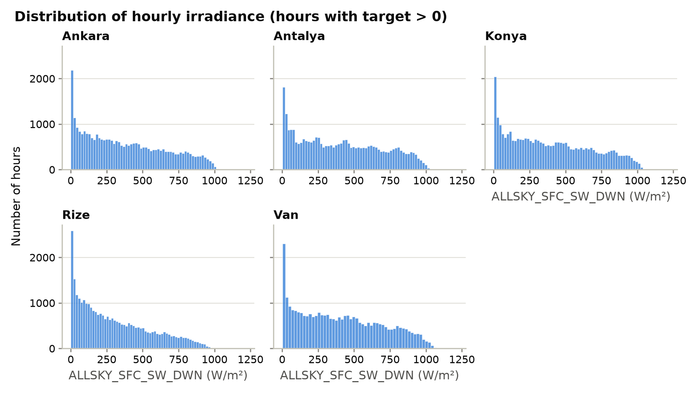
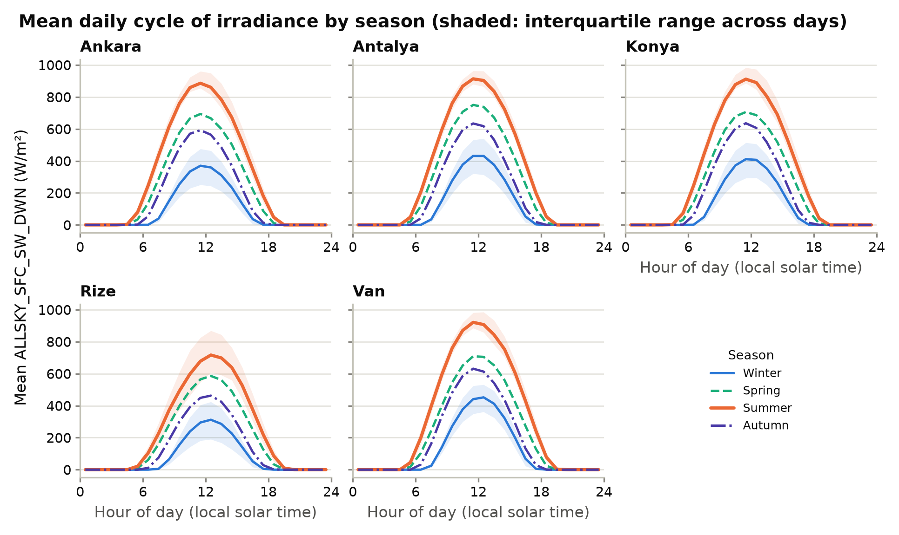
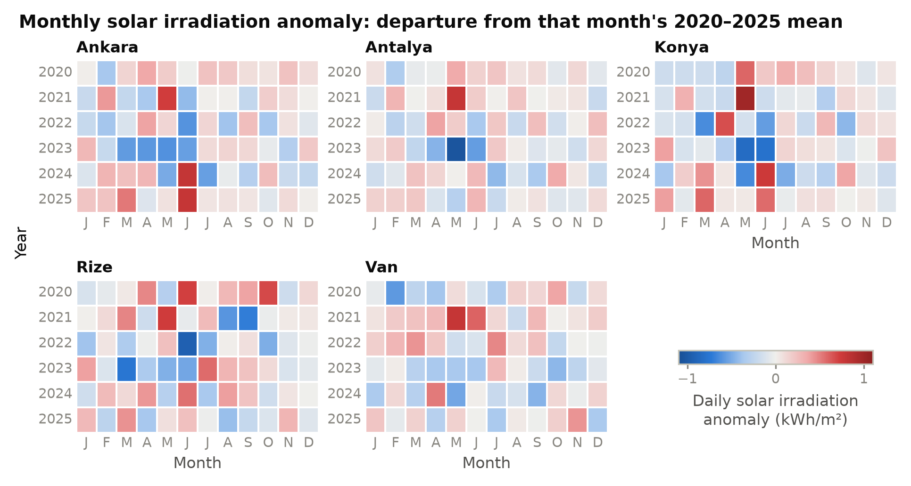
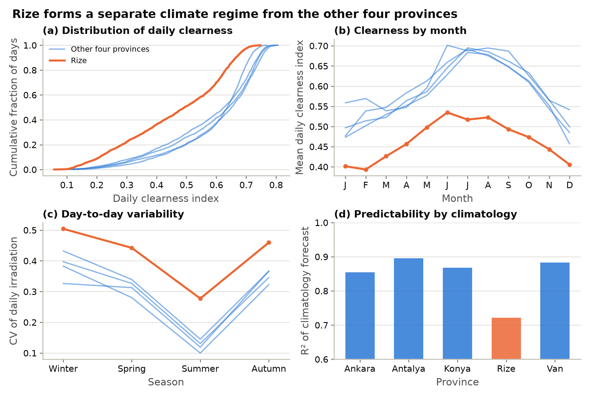
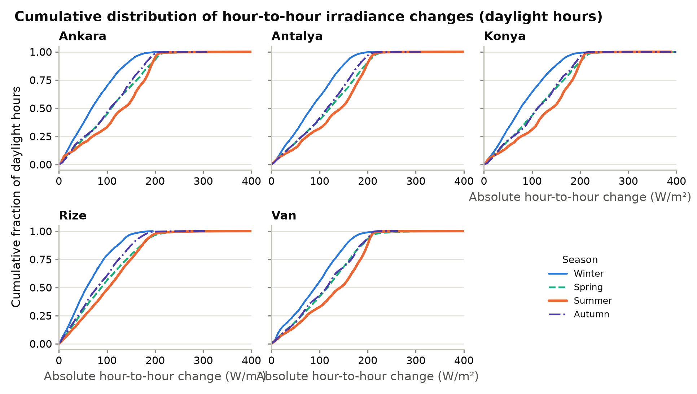
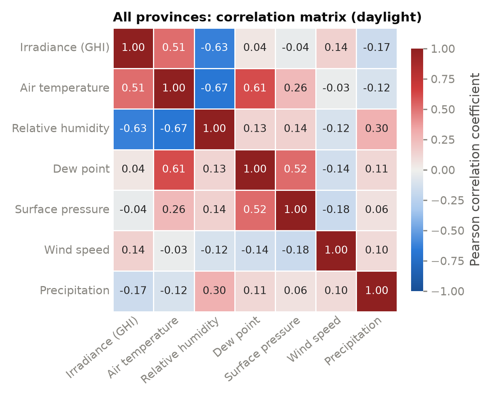
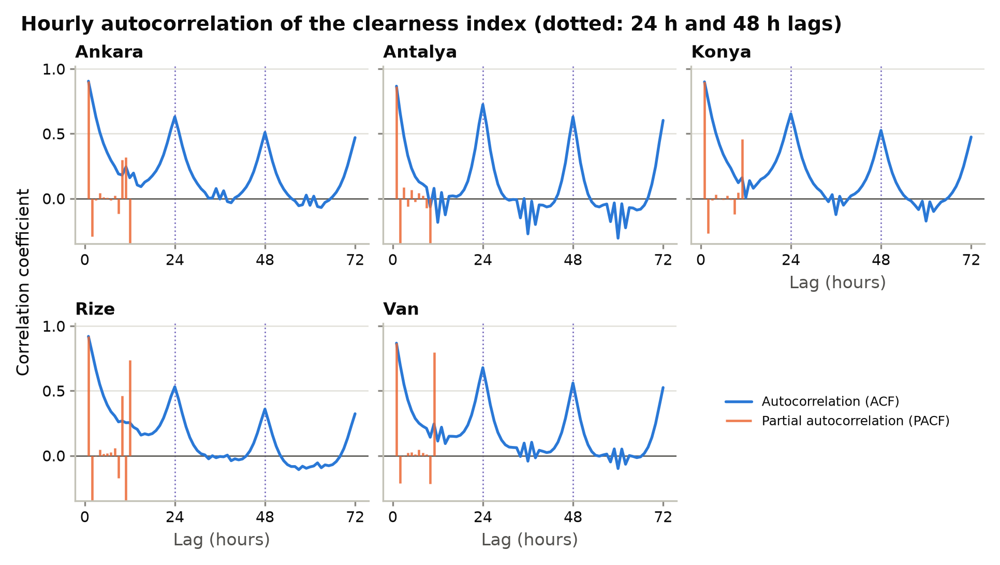
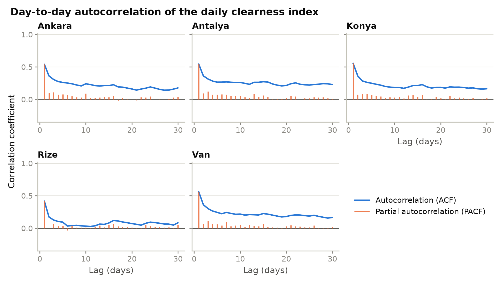
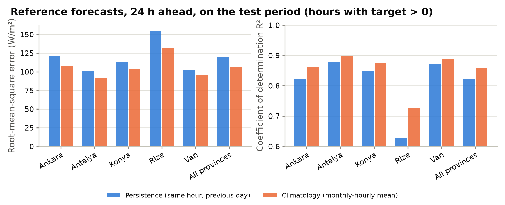

# Dataset Description

## 1. Source and study sites

The data used in this study are hourly meteorological and solar-radiation records obtained from
the NASA Prediction Of Worldwide Energy Resources (POWER) project, which derives surface
solar-radiation fields from satellite observations and assimilated meteorological reanalysis.
Records were retrieved for five provinces of Türkiye — Ankara, Antalya, Konya, Rize and Van —
selected to span distinct climatic and topographic settings rather than to represent a single
region. Their coordinates and elevations are given in Table 1.

**Table 1.** Study sites.

| Province | Latitude (°N) | Longitude (°E) | Elevation (m) | Setting |
|---|---|---|---|---|
| Ankara | 39.93 | 32.86 | 890 | Central Anatolian plateau, semi-arid |
| Antalya | 36.90 | 30.69 | 30 | Mediterranean coast |
| Konya | 37.87 | 32.48 | 1020 | Central Anatolian steppe, continental semi-arid |
| Rize | 41.02 | 40.52 | 5 | Eastern Black Sea coast, humid subtropical |
| Van | 38.49 | 43.38 | 1725 | Eastern Anatolian highland, continental |

The site selection is deliberately asymmetric, and the analysis below shows that the asymmetry is
larger than the geographic spread suggests: four of the five sites form a single radiative
regime, while Rize constitutes a second one. This is treated as a property of the dataset rather
than as a limitation, because it is precisely the configuration under which a model's ability to
transfer across climates can be tested.

## 2. Temporal coverage and sampling

Each site is represented by an uninterrupted hourly series spanning 30 June 2019 00:00 to
29 June 2026 23:00, comprising 61,368 hourly observations per site — 2,557 days, or seven years —
and 306,840 observations in total. Coverage is identical across sites: the five
series share the same timestamps, with no gaps, no duplicate timestamps and no missing values
after the preprocessing described in Section 4.

The record terminates on 29 June 2026 because the provider's near-real-time processing latency
leaves the final 24 hours of the retrieved file without validated irradiance values. Those hours
were removed; the meteorological variables are complete to the end of the retrieved file, so the
truncation is governed by the target variable alone.

### 2.1 Time convention

An aspect of the data that materially affects any diurnal analysis is that the hourly timestamps
are **not expressed in a single time zone**. Each site is recorded in its own whole-hour local
solar time, corresponding to UTC offset by the nearest hour to its longitude.

This was verified from the data itself. Taking the irradiance-weighted centre of mass of the mean
diurnal profile as an empirical solar-noon estimate yields

> Konya 11.25 ≈ Ankara 11.25 < Antalya 11.41 < Van 11.56 < Rize 11.89

which is the **reverse** of the ordering that a shared national clock would produce — under a
common clock the easternmost sites would peak earliest — and reproduces the longitude-derived
expectation to within 0.1 h at every site.

Two consequences follow and are observed throughout the analysis. First, a given hour index does
not denote the same physical instant at different sites, so hourly quantities are never pooled or
compared across sites; each site is presented in its own panel. Second, the cyclical encoding of
the hour of day used as a model input is more informative under this convention than it would be
under a shared clock, because each site is implicitly encoded in its own solar time. Hour labels
denote the start of the interval they cover; all diurnal figures are plotted at interval centres
and axes are labelled in local solar time.

## 3. Variables

The retrieved dataset provides one radiation variable, which is used as the forecast target, and
six meteorological variables used as predictors, together with the calendar fields required to
construct the timestamp. Table 2 reports pooled descriptive statistics over the complete record.

**Table 2.** Descriptive statistics of the retrieved variables, pooled over all five sites and
all 306,840 hourly observations.

| Variable | Description | Unit | Mean | SD | Min | Max | Skewness |
|---|---|---|---|---|---|---|---|
| ALLSKY_SFC_SW_DWN | All-sky downward shortwave irradiance at the surface (target) | W/m² | 195.12 | 276.49 | 0.00 | 1215.88 | 1.27 |
| T2M | Air temperature at 2 m | °C | 12.04 | 10.36 | −24.33 | 42.30 | 0.05 |
| RH2M | Relative humidity at 2 m | % | 64.82 | 24.40 | 3.36 | 100.00 | −0.37 |
| T2MDEW | Dew-point temperature at 2 m | °C | 4.01 | 7.38 | −30.33 | 23.81 | −0.21 |
| PS | Surface pressure | kPa | 88.32 | 6.04 | 75.74 | 97.73 | −0.65 |
| WS2M | Wind speed at 2 m | m/s | 2.14 | 1.41 | 0.00 | 13.65 | 1.39 |
| WD2M | Wind direction at 2 m | ° | — (circular; see Section 8.2) | | | | |
| PRECTOTCORR | Bias-corrected total precipitation | mm/hour | 0.073 | 0.281 | 0.00 | 14.49 | 9.48 |

Two variables require comment before any statistic drawn from them is interpreted.

**Surface pressure does not behave as a meteorological variable in a pooled setting.** Its pooled
standard deviation is 6.04 kPa while its between-site standard deviation is 6.73 kPa: essentially
all of its variance lies between sites rather than within them (site means range from 77.7 kPa at
Van to 96.0 kPa at Antalya), reflecting elevation rather than weather. Its within-site variation,
with a standard deviation of roughly 0.4–0.5 kPa, is the genuine synoptic signal. In a pooled
model, surface pressure therefore functions largely as an elevation indicator, and this is the
reason its apparent relationship with irradiance reverses once site and season are held fixed
(Section 9).

**Precipitation is effectively a binary variable at hourly resolution.** Exactly 66.7% of the
hours with positive irradiance (Section 5) record zero precipitation, and the non-zero tail is
strongly right-skewed (skewness +9.5 over all hours). Over those hours, a binary wet/dry indicator is more strongly correlated with
irradiance than either the recorded amount or its logarithmic transform at four of the five sites
(Ankara, Antalya, Konya and Van), while at Rize the logarithmic transform is the strongest of the
three.

**Dew-point temperature is not an independent measurement.** It can be reconstructed from air
temperature and relative humidity through the Magnus relation with a Pearson correlation of
0.99919 and a root-mean-square deviation of 0.30 °C over all hours (0.99957 and 0.22 °C over
hours with positive irradiance) — that is, at the level of the data's own rounding. It is retained for
completeness but carries no information beyond the two variables from which it is derived. This
redundancy is invisible to pairwise correlation analysis, because it is a two-variable
relationship: the pairwise correlation between air temperature and dew point is only 0.61
(Section 9.2).

## 4. Data quality and preprocessing

**Missing values.** The provider encodes missing observations with a sentinel value. After
removal of the 24-hour near-real-time tail described in Section 2, no sentinel value and no
missing entry remains in any variable at any site. No imputation was performed, and no
observation was interpolated.

**Units.** The retrieved irradiance is expressed directly in W/m², the unit customary in the
solar-forecasting literature, and no conversion was applied. Precipitation is retained in mm/hour, the natural unit for an hourly record. Summing the
precipitation column over complete calendar years yields site totals of 340 mm (Ankara), 326 mm
(Konya), 343 mm (Van), 664 mm (Antalya) and 1399 mm (Rize) per year, which reproduce the correct
ordering and order of magnitude of Turkish climate normals and confirm the unit interpretation.
Consistent with the known behaviour of satellite-derived precipitation products, the values
under-estimate observed normals at the two wettest sites.

**Numerical resolution.** The retrieved irradiance is stored to two decimal places, that is, with
a resolution of 0.01 W/m²; the entire record contains 38,385 distinct target values. The
resulting quantisation noise has a standard deviation of about 0.003 W/m², several orders of
magnitude below the error of any forecast considered here, and is therefore immaterial to the
reported accuracy metrics and to the interpretation of irradiance differences in this dataset.

**Physically inadmissible values.** One observation in the record (Van, 17 February 2020, 15:00
local solar time) reports 1215.88 W/m², which exceeds the extraterrestrial irradiance incident on
a horizontal surface at that site and hour (544 W/m²) by more than a factor of two. It is
physically impossible and is treated as a retrieval or back-fill artefact. It was neither removed
nor modified, since a single observation in 306,840 cannot affect any aggregate reported here, but
it must not be used to support any claim about the radiative extremes of the site.

## 5. Subsets: hours with positive irradiance and geometric daylight

Roughly half of all hourly observations are night hours in which the target is exactly zero. These
observations are trivially predictable and, if included, dominate aggregate error statistics
(Section 12). Two different subsets are therefore used in this work, and each has one job.

**Descriptive subset: hours with positive irradiance.** Every descriptive statistic, table and
figure from Section 6 onwards that is restricted to daytime is computed on the hours in which the
recorded irradiance is strictly positive (target > 0). The criterion is applied to the data as
recorded; it needs no solar-position calculation and no threshold. Because the provider's
missing-value sentinel (−999) is negative, the criterion would also exclude any such value; none is
present after the preprocessing of Section 4, and no negative irradiance occurs. The criterion
removes 148,729 of the 306,840 observations (48.47%) and retains 158,111 (51.53%). The numbers
removed, out of 61,368 per site, are 29,618 at Ankara (48.3%), 29,969 at Antalya (48.8%), 29,667 at
Konya (48.3%), 29,801 at Rize (48.6%) and 29,674 at Van (48.4%). The retained hours amount to a mean
of 12.28 (Antalya) to 12.42 (Ankara) hours per day.

**Evaluation subset: geometric daylight.** The forecasting experiments are scored on a different
subset, defined **geometrically**: an hour is classified as daylight if the apparent elevation of
the Sun at the midpoint of that hour, computed from the site coordinates and the timestamp using a
standard solar-position algorithm, is positive. Under this definition 155,081 of 306,840
observations (50.54%) are daylight, with a mean daylight duration of 12.10–12.16 h per day across
sites. The geometric criterion is used for evaluation because it depends on site and time alone. A
criterion based on the recorded irradiance defines the subset using the quantity being predicted: a
heavily overcast hour that happens to record zero would be silently excluded, so observations are
removed preferentially from the conditions under which a forecast is hardest. More decisively, such
a criterion cannot be applied prospectively: a day-ahead forecast must determine whether the Sun will
be above the horizon at a future hour without access to the observation at that hour. A geometric
criterion is required for that purpose in any case, and for the same reason it also governs the
treatment of night hours in the forecasts. The two roles do not conflict. When the aim is to describe
the recorded data, conditioning on the recorded value is harmless; when the aim is to score a
forecast, it is not.

The geometric threshold was not calibrated against the observations. Sweeping it produces a value
that agrees more closely with the recorded irradiance, but adjusting a geometric criterion to fit
the observed target reintroduces exactly the dependence the criterion is intended to avoid. The
cost of leaving it uncalibrated was quantified and is small: the error of the strongest reference
forecast changes by approximately 1%. A climatological criterion based on the mean irradiance of a
(site, month, hour) cell was also examined and rejected as too coarse: sunrise and sunset shift by
30–60 minutes within a calendar month, so the boundary hour of a cell is illuminated for part of the
month and dark for the remainder, and a cell mean classifies the entire hour as daylight. Applied to
this dataset it admitted 8,401 observations occurring when the Sun was below the horizon.

**Relationship between the two subsets.** The two criteria agree on 303,810 of 306,840
observations. No hour classified as geometric daylight records zero irradiance, so the
positive-irradiance subset contains the whole of the geometric daylight subset. The two differ only by
3,030 observations (1.9% of the retained hours) that carry a small positive irradiance while the Sun
is up to 2.4° below the horizon at the interval midpoint. These twilight hours occur at the start and
end of the day (local solar hours 04–07 and 16–19), and their irradiance is low: mean 4.74 W/m²,
standard deviation 1.64 W/m², minimum 0.80 W/m² and maximum 11.68 W/m². By site, the number of
twilight hours and their mean irradiance are 760 hours and 4.76 W/m² at Ankara, 424 and 4.50 W/m² at
Antalya, 765 and 5.30 W/m² at Konya, 489 and 3.56 W/m² at Rize and 592 and 5.14 W/m² at Van.
Together they account for 0.024% of the energy recorded over the positive-irradiance hours, and they
lower the pooled mean irradiance of the positive-irradiance subset by about 2% relative to the
geometric one. Statistics computed on the two subsets are therefore close but not identical, and the
evaluation of forecasts always refers to the geometric subset.

## 6. Statistical characterisation of the target

### 6.1 Distribution

Over hours with positive irradiance and pooled across sites, irradiance has a mean of 378.7 W/m²,
a median of 334.6 W/m² and a standard deviation of 280.8 W/m², with skewness +0.43 and excess
kurtosis −0.95.
Over all 24 hours the mean falls to 195.1 W/m² and the median to 7.8 W/m², with skewness +1.27.

The contrast between these two summaries reflects the mixture structure of the unconditional
distribution: a point mass of exact zeros at night superimposed on the distribution of daytime values. The
daytime distribution itself is **platykurtic** — broad and flat rather than peaked — which is the
direct consequence of solar geometry sweeping irradiance from zero to approximately 1000 W/m²
within each day. Figure 1 shows the per-site distributions over hours with positive irradiance.

**Figure 1.** Distribution of hourly irradiance over hours with positive irradiance (target > 0), by site.

Site-level statistics are given in Table 3.

**Table 3.** Target variable by site, hours with positive irradiance (target > 0).

| Site | N | Mean (W/m²) | SD (W/m²) | Median (W/m²) | Max (W/m²) | Skewness | Daily total (kWh/m²/day) |
|---|---|---|---|---|---|---|---|
| Ankara | 31,750 | 379.35 | 280.88 | 333.59 | 1029.10 | 0.43 | 4.71 |
| Antalya | 31,399 | 407.28 | 286.21 | 383.23 | 1043.07 | 0.29 | 5.00 |
| Konya | 31,701 | 397.12 | 286.47 | 358.10 | 1054.35 | 0.37 | 4.92 |
| Rize | 31,567 | 303.72 | 248.67 | 245.05 | 988.15 | 0.70 | 3.75 |
| Van | 31,694 | 405.84 | 286.40 | 376.17 | 1215.88 | 0.34 | 5.03 |
| **Pooled** | **158,111** | **378.67** | **280.80** | **334.58** | **1215.88** | **0.43** | **4.68** |

### 6.2 Diurnal and seasonal structure

Hour of day alone accounts for 73.2% of the variance of the target over all 24 hours, and for
50.4% within the subset of positive-irradiance hours; day of year accounts for 8.7% and 14.4%
respectively. A harmonic
(sine–cosine) representation of each recovers essentially the whole of this explained variance
(for example 0.7291 against 0.7318 for hour of day over 24 hours), which supports the use of
cyclical rather than categorical encodings of time.

The practical implication is that roughly three quarters of an aggregate score computed over all
24 hours reflects knowledge of the day–night cycle rather than any forecast skill, and that within
the daytime hours the seasonal contribution rises from 8.7% to 14.4% of the variance.

Seasonal means and variability are summarised in Table 4, and the diurnal profile by season is
shown in Figure 2.

**Figure 2.** Mean diurnal irradiance profile by season and site, plotted in local solar time. The
shaded band shows the between-day interquartile range for winter and summer.

**Table 4.** Seasonal characteristics, averaged over sites. Meteorological seasons are used
(winter = December–February).

| Season | Mean irradiance, 24 h (W/m²) | Mean irradiance, target > 0 (W/m²) | Daily total (kWh/m²/day) | Between-day CV |
|---|---|---|---|---|
| Winter | 98.4 | 230.1 | 2.36 | 0.409 |
| Spring | 218.7 | 393.8 | 5.25 | 0.340 |
| Summer | 296.8 | 494.6 | 7.12 | 0.154 |
| Autumn | 164.6 | 345.3 | 3.95 | 0.372 |

A structurally important feature emerges from the last column: **irradiance and its predictability
move in opposite directions across the year.** Summer days are not only brighter but markedly less
variable between days. Expressed per site, the ratio of winter to summer coefficient of variation
is 2.98 at Ankara, 3.83 at Antalya, 3.04 at Konya, 2.74 at Van and 1.82 at Rize. Any error metric
computed over the full year therefore aggregates two regimes of very different difficulty, and a
small absolute error in winter does not indicate stronger performance in winter — there is simply
less to predict.

### 6.3 Inter-annual variability

Over the six complete calendar years contained in the record (2020–2025), the mean daily total
varies little from year to year: the relative standard deviation is 1.8–3.3% depending on the
site, and the spread between the best and worst year ranges from 5.1% (Konya) to 8.0% (Van). Rize
is again the exception at 10.3%. Table 5 reports the annual means; Figure 3 presents the same
information as a month-by-year anomaly field, which separates the inter-annual signal from the
seasonal cycle that dominates the raw surface.

**Figure 3.** Month-by-year irradiance anomaly, expressed as the departure of each month from its
six-year mean, by site.

**Table 5.** Mean daily total irradiance (kWh/m²/day) by complete calendar year.

| Site | 2020 | 2021 | 2022 | 2023 | 2024 | 2025 | Best/worst spread |
|---|---|---|---|---|---|---|---|
| Ankara | 4.83 | 4.73 | 4.64 | 4.56 | 4.72 | 4.89 | 7.2% |
| Antalya | 5.06 | 5.13 | 5.04 | 4.86 | 4.99 | 5.04 | 5.6% |
| Konya | 5.01 | 4.98 | 4.87 | 4.84 | 4.90 | 5.09 | 5.1% |
| Rize | 3.91 | 3.75 | 3.54 | 3.68 | 3.82 | 3.74 | 10.3% |
| Van | 4.95 | 5.26 | 5.16 | 4.87 | 4.95 | 5.05 | 8.0% |

## 7. Clearness index and regional differentiation

Comparing sites on irradiance alone confounds latitude with atmospheric condition. The comparison
is therefore made on the **clearness index**, defined in the standard way as the ratio of measured
global horizontal irradiance to the extraterrestrial irradiance incident on a horizontal surface
at the same instant,

> kt = GHI / (I₀ cos θ_z),

where I₀ is the extraterrestrial normal irradiance including the Earth–Sun distance correction and
θ_z is the solar zenith angle. The denominator is a purely astronomical quantity, so the index
isolates atmospheric attenuation. Hours with an extraterrestrial irradiance below 20 W/m² are
excluded, as the ratio is numerically unstable at twilight.

The index is well behaved on this dataset: its median is 0.557, its 99th percentile is 0.801, and
only 2 of 152,902 illuminated hours exceed unity. No clipping or truncation was applied. Sky
conditions are classified using the conventional bands for this index, namely clear above 0.65 and
overcast below 0.35.

Table 6 shows that the five sites do not form a single population.

**Table 6.** Radiative regime by site. Clearness index values are daily.

| Measure | Ankara | Antalya | Konya | Van | **Rize** |
|---|---|---|---|---|---|
| Daily total (kWh/m²/day) | 4.71 | 5.00 | 4.92 | 5.03 | **3.75** |
| Mean daily clearness index | 0.575 | 0.589 | 0.589 | 0.610 | **0.464** |
| Median hourly clearness index | 0.566 | 0.584 | 0.587 | 0.601 | **0.424** |
| Clear-day share (kt > 0.65) | 44.0% | 44.0% | 47.4% | 50.3% | **14.2%** |
| Overcast-day share (kt < 0.35) | 11.2% | 8.7% | 10.4% | 6.3% | **28.6%** |
| Between-day coefficient of variation | 0.488 | 0.435 | 0.455 | 0.444 | **0.565** |

Four of the sites differ from one another by 7% in mean daily total and occupy a narrow band on
every measure in the table. Rize lies 20–25% below that band in level and, more importantly, in a
different position on every measure of variability: it experiences overcast days between two and
a half and four and a half times as often as any other site, and reaches clear-sky conditions on roughly one day in
seven against one day in two. Its **best** season (summer, mean clearness 0.525) is comparable to
the other sites' **winter** (0.477–0.556). The difference is therefore one of regime, not of
degree. Figure 4 summarises this comparison.

**Figure 4.** Radiative regime of Rize against the other four sites: cumulative distribution of
the daily clearness index, the monthly clearness cycle, seasonal between-day variability, and the
accuracy of the climatological reference forecast.

Van occupies the opposite extreme: the highest daily total, the highest clearness index, the lowest
overcast-day share and the lowest winter variability of the five, consistent with its combination
of high elevation and dry continental air.

## 8. Meteorological structure

### 8.1 Hour-to-hour variability

The distribution of absolute change between consecutive hours with positive irradiance is summarised in Table 7.
Most of the variability in raw irradiance is geometric — the Sun rising and setting — so the
informative column is the change in clearness index, which removes that component.

**Table 7.** Hour-to-hour variability over hours with positive irradiance.

| Site | Median \|Δ irradiance\| (W/m²) | 90th pct | 99th pct | Share > 200 W/m² | 99th pct \|Δ clearness\| |
|---|---|---|---|---|---|
| Ankara | 104.9 | 187.5 | 211.2 | 3.7% | 0.220 |
| Antalya | 115.3 | 192.6 | 218.8 | 6.3% | 0.216 |
| Konya | 109.7 | 193.1 | 216.1 | 6.3% | 0.221 |
| Rize | 82.2 | 167.5 | 213.3 | 1.7% | 0.206 |
| Van | 114.6 | 194.4 | 217.1 | 7.0% | 0.222 |

On the clearness scale the five sites are strikingly similar (0.206–0.222 at the 99th percentile).
Rize's smaller raw ramps therefore reflect a weaker radiative envelope rather than a steadier
atmosphere. Figure 5 shows the cumulative distributions.

**Figure 5.** Cumulative distribution of the absolute hour-to-hour change in irradiance over
hours with positive irradiance, by season and site.

### 8.2 Wind direction

Wind direction is a circular variable whose arithmetic mean is not meaningful, and it is
summarised using speed-weighted circular statistics with calm hours (speed at or below 1 m/s)
excluded. The resultant length R ranges from 0, for a completely dispersed distribution, to 1 for a
single prevailing direction.

**Table 8.** Circular statistics of wind direction.

| Site | Mean direction (°) | Resultant length R | Circular SD (°) |
|---|---|---|---|
| Van | 216 | 0.468 | 71 |
| Rize | 271 | 0.246 | 96 |
| Konya | 338 | 0.229 | 98 |
| Antalya | 43 | 0.189 | 105 |
| Ankara | 335 | 0.124 | 117 |

Only Van exhibits a pronounced prevailing direction. At the remaining four sites the distribution
is close to uniform, and wind direction carries correspondingly little information about
irradiance. The share of calm hours differs substantially between sites (from 8,755 at Konya to
16,407 at Rize), and direction in those hours is essentially noise; this exclusion should be borne
in mind whenever direction statistics are compared across sites.

## 9. Relationships among variables

### 9.1 Raw and partial association with the target

A correlation computed directly between a meteorological variable and irradiance is confounded
with solar geometry, because most meteorological variables themselves follow the diurnal and
seasonal cycles. To separate the two, the correlation was recomputed after removing the mean of
each (site, month, hour) cell, which holds solar geometry and season fixed. Table 9 contrasts the
two.

**Table 9.** Correlation with irradiance, pooled over hours with positive irradiance.

| Variable | Raw r | Partial r (within site–month–hour) |
|---|---|---|
| RH2M | −0.627 | **−0.523** |
| T2M | +0.517 | +0.305 |
| PRECTOTCORR | −0.162 | **−0.326** |
| T2MDEW | +0.045 | **−0.269** |
| PS | −0.035 | **+0.266** |
| WS2M | +0.154 | **−0.148** |

Three variables reverse sign and the association of precipitation approximately doubles. The
mechanism is straightforward: warm, windy, high-dew-point hours are predominantly summer midday
hours, when irradiance is already high for geometric reasons. Removing that confound eliminates
the spurious association and reveals the physical one, in which moisture and cloud reduce
irradiance.

The strongest evidence that the partial formulation is the correct one is its behaviour across
sites. Under raw correlation, surface pressure and wind speed take **inconsistent signs** at
different sites. Under partial correlation, **all six variables take the same sign at all five
sites.** Once solar geometry is removed, the sites agree about the physics. Figure 6 presents the
correlation structure.

**Figure 6.** Correlation matrix of the target and the meteorological variables over hours with
positive irradiance, pooled across sites.

Relative humidity is the only variable that is strongly associated with irradiance under both
formulations. It is, on this dataset, the single most informative meteorological predictor.

### 9.2 Linearity and redundancy

Spearman and Pearson coefficients agree closely: the largest discrepancy against the target is
−0.052 for precipitation, followed by +0.051 for wind speed, and no variable exceeds 0.06. There
is therefore no evidence of a non-monotonic relationship. That the discrepancy concentrates in
precipitation and wind speed is expected, both being strongly skewed, and the fact that the rank
correlation is the larger of the two supports treating precipitation on a rank or indicator scale
rather than as a linear quantity.

Among the predictors, no pair exceeds a correlation of 0.9. The pairs exceeding 0.5 are air
temperature with relative humidity (−0.672), air temperature with dew point (+0.611) and dew point
with surface pressure (+0.517), all of which are physically expected and none of which indicates
redundancy at a level requiring removal.

This pairwise result should not, however, be read as evidence that the variable set is free of
redundancy. As noted in Section 3, dew-point temperature is an exact function of air temperature
and relative humidity, reproducible to 0.30 °C; pairwise correlation cannot detect this because
the relationship involves two variables jointly. A collinearity screen of this kind provides a
lower bound on redundancy, never an upper one.

## 10. Temporal dependence

The autocorrelation structure was examined on the clearness index rather than on raw irradiance.
The autocorrelation of raw irradiance is dominated almost entirely by the diurnal cycle and is
therefore uninformative; dividing out the astronomical component leaves the persistence of
atmospheric condition, which is the quantity a forecast must actually exploit. Figures 7a and 7b
show both resolutions.

**Figure 7a.** Autocorrelation and partial autocorrelation of the clearness index at hourly
resolution, by site. Dotted lines mark lags of 24 and 48 h.

**Figure 7b.** Autocorrelation and partial autocorrelation of the clearness index at daily
resolution, by site.

**Table 10.** Partial autocorrelation of the clearness index.

| | Ankara | Antalya | Konya | Rize | Van |
|---|---|---|---|---|---|
| Hourly, lag 1 | 0.905 | 0.866 | 0.900 | 0.920 | 0.868 |
| Hourly, lag 2 | −0.302 | −0.376 | −0.274 | −0.350 | −0.218 |
| Hourly, lag 3 | −0.010 | +0.089 | −0.016 | −0.004 | −0.004 |
| Daily, lag 1 | 0.540 | 0.546 | 0.558 | **0.420** | 0.562 |
| Daily, lag 2 | 0.094 | 0.094 | 0.073 | **−0.001** | 0.069 |
| Daily, lag 3 | 0.113 | 0.122 | 0.081 | 0.071 | 0.110 |

At the hourly resolution the series behaves as a second-order autoregressive process: the
first-lag partial autocorrelation exceeds 0.87 at every site, the second lag is distinctly
negative, and the third is indistinguishable from zero.

The daily resolution is the one that governs a day-ahead forecast, and there the decay is sharp.
The partial autocorrelation falls from 0.420–0.562 at one day to between −0.001 and 0.094 at two
days — a six-fold or greater reduction. Beyond the first lag, the information available to a
day-ahead forecast from the target's own history is close to exhausted. The residual
autocorrelation still visible at a lag of 30 days (0.08–0.23) reflects the seasonal cycle rather
than memory, and is already captured by the cyclical encoding of day of year.

Rize again lies outside the band on every line, and consistently in the direction of shorter
memory: its atmospheric condition is not only more variable but also less persistent.

An additional structural property constrains any multi-hour forecast on this dataset. Hours with
positive irradiance occur in uninterrupted daily blocks of median length 12 h at four sites and 13 h
at Rize (minimum 9, maximum 15 across sites), and no block reaches 24 h at any site. A forecast horizon of one day therefore **always** spans at least
one night period, so approximately half of every forecast window is determined by geometry alone.

## 11. Data partitioning

The record is divided chronologically, with the oldest observations used for training and the most
recent for testing, so that no future information is available at training time. The boundaries
fall on identical dates at all five sites, so every site is split on the same calendar and the
partitions remain comparable across sites.

**Table 11.** Chronological partitions.

| Partition | Period | Hours per site | Days |
|---|---|---|---|
| Training | 30 Jun 2019 00:00 – 3 Sep 2024 03:00 | 45,412 | 1,892 |
| Validation | 3 Sep 2024 04:00 – 11 Jun 2025 09:00 | 6,750 | 281 |
| Test | 11 Jun 2025 10:00 – 29 Jun 2026 23:00 | 9,206 | 384 |

The proportions were chosen so that the test partition exceeds one full year, which it does at 384
days. This is a deliberate constraint rather than an arbitrary split: a test period shorter than a
year would sample the seasonal cycle unevenly and bias the reported error towards whichever
seasons it happened to contain. As partitioned, the test period covers 13 calendar months and all
four seasons, with 11,040 spring, 13,270 summer, 10,920 autumn and 10,800 winter site-hours.

The validation partition, by contrast, spans ten calendar months, of which June is represented only
by its first eleven days, and contains no July and no August. This asymmetry is a consequence of requiring a full-year test period within a record of this length
and is noted because it constrains any procedure calibrated on the validation partition: the
summer months absent from it are also the months of highest irradiance and lowest day-to-day
variability.

## 12. Intrinsic predictability

To establish the difficulty of the forecasting problem independently of any learned model, two
non-parametric reference forecasts were evaluated on the test partition: **persistence**, which
repeats the value observed 24 h earlier, and **climatology**, the mean of the corresponding
(site, month, hour) cell computed on the training partition alone. Both were scored through the
same windowing procedure as the models. The descriptive summary below, like the other tables of this
description, is computed on the hours with positive irradiance (Section 5). The comparison with
learned models is made on the geometric daylight subset, on which the same references are scored
through the identical evaluation procedure; its values differ from those of Table 12 by roughly one
percent, and it is the subset on which a model has to improve on them.

**Table 12.** Reference forecast accuracy on the test partition, pooled over sites.

| Reference | Subset | RMSE (W/m²) | MAE (W/m²) | R² |
|---|---|---|---|---|
| Persistence | All 24 hours | 86.38 | 36.56 | 0.905 |
| Climatology | All 24 hours | 77.17 | 37.94 | 0.924 |
| Persistence | **Target > 0** | 119.76 | **70.27** | 0.822 |
| Climatology | **Target > 0** | **106.99** | 72.84 | **0.858** |

Three properties of this table govern how the model results in this paper should be read.

**First, night observations inflate every metric.** The same climatological reference attains
RMSE 77.2 W/m² and R² 0.924 when evaluated over all hours, but RMSE 107.0 W/m² and R² 0.858 over
the hours with positive irradiance. Including night observations reduces RMSE by 28% and raises R²
by 0.066 without any contribution from the forecast. Because R² is normalised by the variance of the subset over
which it is computed, and that variance is dominated by the day–night oscillation, an all-hours
R² above 0.9 on this dataset is not evidence of forecast skill. Daytime statistics (geometric
daylight for forecasts, positive-irradiance hours for description) are reported throughout this work
as the primary results.

**Second, the reference to beat is climatology, not persistence.** At a horizon of 24 h,
persistence is aligned with the diurnal cycle and therefore inherits the deterministic geometric
component at no cost; exceeding it is not in itself informative. Climatology is the stronger
reference on RMSE and R².

**Third, no single reference dominates.** Climatology is the stronger of the two on RMSE and R²,
while persistence is stronger on MAE, reflecting the asymmetry of the error distribution. A
forecast must therefore be shown to improve on the climatological RMSE and R² and on the persistence
MAE (107.0 W/m², 0.858 and 70.3 W/m² respectively in Table 12) before it can be said to have improved
on the naive references at all.

Site-level reference accuracy quantifies the regime difference of Section 7. The climatological
reference attains an RMSE over positive-irradiance hours of 92.0 W/m² at Antalya, 95.3 at Van,
103.4 at Konya and 107.0 at Ankara, but 132.4 at Rize, with R² falling from 0.90 to 0.73. Figure 8 shows this comparison. The
pooled figure, in which four similar sites outvote one dissimilar one, understates the difficulty
Rize presents.

**Figure 8.** Accuracy of the naive reference forecasts on the test partition, by site, over
hours with positive irradiance.

## 13. Summary

The dataset comprises 306,840 hourly observations distributed evenly over five Turkish sites and
seven years, with no missing values, one radiation variable and six meteorological
predictors. Its principal characteristics, in the order in which they constrain the analysis, are:

1. Approximately half of all observations are night hours (48.5% read exactly zero irradiance),
   and they must be excluded from evaluation for reported metrics to be interpretable.
2. Timestamps follow per-site local solar time rather than a common zone, so hourly quantities
   cannot be compared across sites.
3. Four sites form a single radiative regime and the fifth, Rize, forms a second one that is both
   less clear and substantially less predictable.
4. Irradiance and its predictability vary inversely over the year, with winter day-to-day
   variability 1.8–3.8 times that of summer.
5. Useful autoregressive information at the daily scale is essentially confined to the preceding
   day.
6. Most raw associations between meteorological variables and irradiance are confounded with solar
   geometry; three of six reverse sign once geometry is controlled for.
7. The naive reference forecasts attain an RMSE of 106.99 W/m² and an R² of 0.858 over hours with
   positive irradiance (climatology), and a MAE of 70.27 W/m² (persistence); on the geometric
   daylight subset used for evaluation the values are about 1% different, and they are the threshold
   any learned model must exceed to constitute a result.
